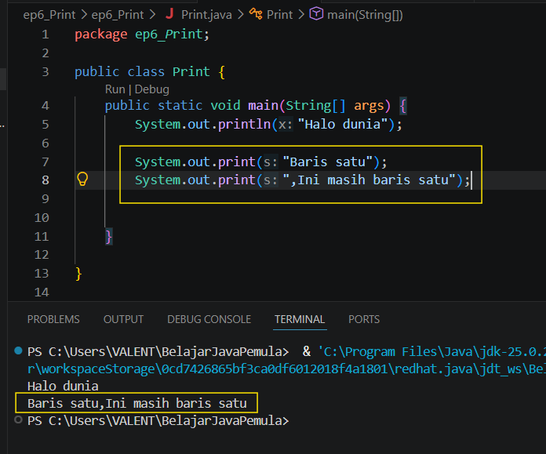
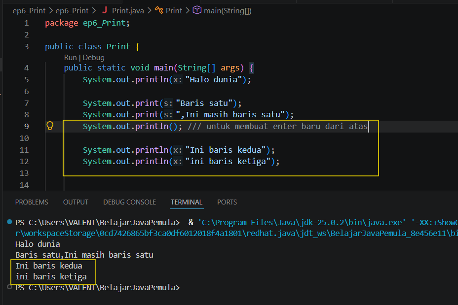
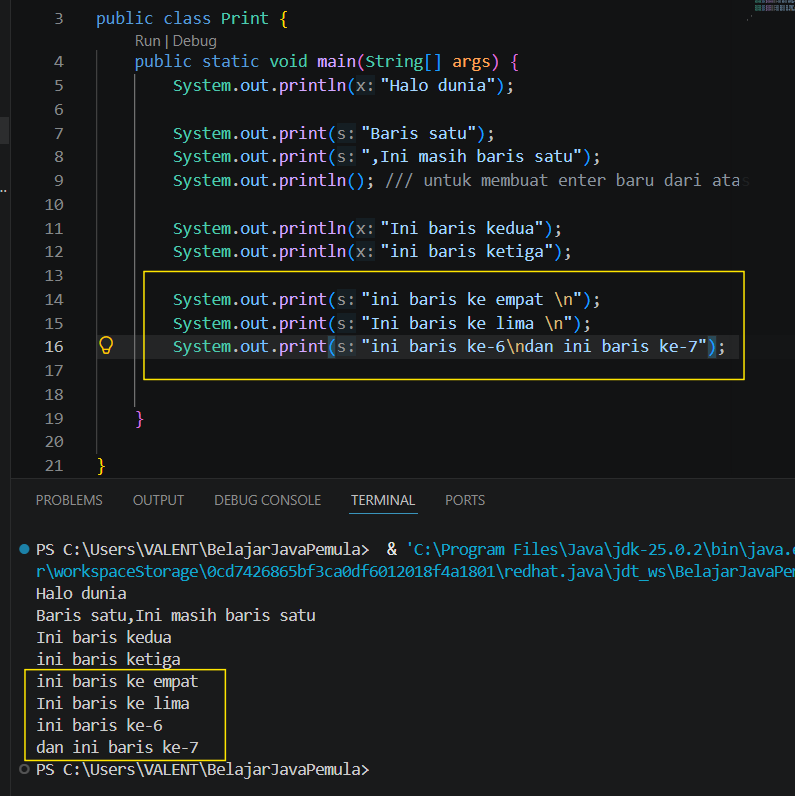

# Pengenalan Print dan Alur Eksekusi

## 1. Proses eksekusi program java
* Program java akan dieksekusi oleh komputer secara berurutan dari baris atas sampe bawah di dalam fungsi utama(Main Method)
* Kalau ada baris yang error maka program akan berhenti di baris yang error itu dan tidak akan melanjutkan nya lagi

## 2. Jenis jenis Print
### 1. ``` System.out.Print() ```
Yang pertama ada print biasa,print ini tidak memiliki enter,jadi misal ada 2 baris print kayak gini:


### 2. ``` System.out.println() ```
Lalu ada tambahan ```ln``` di print biasa jadi ```println```,disini itu dia bakalan nambah baris/enter baru seperti ini:

disitu terlihat kalau saya membuang println kosong untuk menambah enter baru lagi karena jika tidak nanti baris kedua akan tersambung ke bekas print biasa di atas karena tidak ditambah ln nya

### 3. Karakter Khusus (Escape Sequence) 
ini sama aja kayak println,kita akan memakai ``` \n ``` untuk menambah enter,hanya saja kita taruh di dalam tanda kurung seperti ini:

seperti yang terlihat di gambar,saya hanya memakai print biasa dan menggunakan ``` \n ``` untuk menambah enter/baris baru lagi


## 📝 Kuis Java Dasar: Pengenalan Print dan Alur Eksekusi

Uji pemahamanmu mengenai materi dasar Java (Alur Eksekusi, `print`, `println`, dan `\n`) melalui kuis di bawah ini. Pilih jawabanmu terlebih dahulu, lalu klik tombol **Lihat Kunci Jawaban & Pembahasan** untuk mencocokkan hasilnya.

---

### 1. Bagaimana karakteristik utama alur eksekusi sebuah program Java dalam fungsi utama (main method)?
- [ ] A. Program dieksekusi secara acak tergantung kecepatan prosesor.
- [ ] B. Program dieksekusi baris demi baris secara berurutan dari atas ke bawah.
- [ ] C. Program dieksekusi dari baris paling bawah menuju ke atas.
- [ ] D. Semua baris kode dijalankan secara bersamaan dalam satu waktu.

<details>
  <summary><b>👁️ Klik di sini untuk melihat Kunci Jawaban & Pembahasan</b></summary>

  **Jawaban yang Benar:** **B**
  
  *Pembahasan:* Alur eksekusi dasar pada Java bersifat sekuensial (*sequential*), yang berarti komputer akan membaca dan menjalankan instruksi satu per satu mulai dari baris pertama hingga baris terakhir di dalam fungsi utama.
</details>

---

### 2. Apa yang akan terjadi pada alur eksekusi jika komputer menemukan kesalahan (error) di tengah-tengah baris kode?
- [ ] A. Komputer akan melewati baris yang error dan melanjutkan ke baris berikutnya.
- [ ] B. Program akan tetap berjalan sampai selesai, baru menampilkan error di akhir.
- [ ] C. Proses eksekusi akan langsung terhenti di baris yang error, sehingga baris setelahnya tidak dijalankan.
- [ ] D. Komputer otomatis memperbaiki kesalahan tersebut secara mandiri.

<details>
  <summary><b>👁️ Klik di sini untuk melihat Kunci Jawaban & Pembahasan</b></summary>

  **Jawaban yang Benar:** **C**
  
  *Pembahasan:* Karena sifatnya yang berurutan, jika terjadi fatal error di baris tertentu, program tidak bisa melanjutkan ke instruksi berikutnya dan akan langsung menghentikan proses eksekusi (crash/halt).
</details>

---

### 3. Apa perbedaan utama antara perintah `System.out.print()` dan `System.out.println()`?
- [ ] A. `print()` digunakan khusus untuk angka, sedangkan `println()` untuk teks.
- [ ] B. `println()` otomatis menambahkan baris baru (enter) setelah teks dicetak, sedangkan `print()` tidak.
- [ ] C. `print()` menampilkan teks lebih cepat daripada `println()`.
- [ ] D. `println()` hanya bisa digunakan satu kali di dalam kode program.

<details>
  <summary><b>👁️ Klik di sini untuk melihat Kunci Jawaban & Pembahasan</b></summary>

  **Jawaban yang Benar:** **B**
  
  *Pembahasan:* `println` adalah singkatan dari *print line*. Tugasnya adalah mencetak teks ke layar lalu secara otomatis memindahkan kursor cetak ke baris baru di bawahnya. Sementara `print()` membiarkan kursor tetap berada di baris yang sama.
</details>

---

### 4. Perhatikan potongan kode berikut:
`System.out.print("Selamat ");`
`System.out.print("Datang");`

**Bagaimanakah tampilan output yang dihasilkan di layar console?**
- [ ] A. Selamat Datang
- [ ] B. Selamat\nDatang
- [ ] C. Datang Selamat
- [ ] D. Selamat  Datang (ke bawah)

<details>
  <summary><b>👁️ Klik di sini untuk melihat Kunci Jawaban & Pembahasan</b></summary>

  **Jawaban yang Benar:** **A**
  
  *Pembahasan:* Karena menggunakan `print()`, kata "Selamat " dicetak tanpa membuat baris baru. Perintah berikutnya akan langsung menyambung tepat di samping teks tersebut, menghasilkan "Selamat Datang".
</details>

---

### 5. Perhatikan potongan kode berikut:
`System.out.println("Kopi");`
`System.out.println("Susu");`

**Bagaimanakah tampilan output yang dihasilkan di layar console?**
- [ ] A. Kopi Susu
- [ ] B. KopiSusu
- [ ] C. Kopi (di baris 1) dan Susu (di baris 2)
- [ ] D. Susu Kopi

<details>
  <summary><b>👁️ Klik di sini untuk melihat Kunci Jawaban & Pembahasan</b></summary>

  **Jawaban yang Benar:** **C**
  
  *Pembahasan:* Perintah `println()` pada kata "Kopi" langsung memaksa kursor pindah ke baris bawahnya. Oleh karena itu, kata "Susu" dicetak di baris yang baru.
</details>

---

### 6. Karakter khusus (escape sequence) `\n` di dalam string Java berfungsi untuk...
- [ ] A. Menghapus satu karakter di sebelah kiri.
- [ ] B. Membuat teks menjadi tebal (bold).
- [ ] C. Membuat spasi yang lebar seperti tombol Tab.
- [ ] D. Memaksa teks setelah karakter tersebut untuk pindah ke baris baru (newline).

<details>
  <summary><b>👁️ Klik di sini untuk melihat Kunci Jawaban & Pembahasan</b></summary>

  **Jawaban yang Benar:** **D**
  
  *Pembahasan:* Karakter `\n` adalah perintah teks (*escape sequence*) untuk *newline*. Efeknya sama seperti menekan tombol Enter di keyboard pada posisi karakter tersebut diletakkan.
</details>

---

### 7. Perhatikan kode berikut:
`System.out.print("Baris Satu\nBaris Dua");`

**Meskipun menggunakan perintah `print()`, apa hasil output dari kode di atas?**
- [ ] A. Baris SatuBaris Dua
- [ ] B. Baris Satu Baris Dua
- [ ] C. Baris Satu (di baris 1) dan Baris Dua (di baris 2)
- [ ] D. Baris Satu\nBaris Dua

<details>
  <summary><b>👁️ Klik di sini untuk melihat Kunci Jawaban & Pembahasan</b></summary>

  **Jawaban yang Benar:** **C**
  
  *Pembahasan:* Walaupun fungsi utamanya menggunakan `print()`, adanya karakter `\n` di tengah-tengah teks tetap akan memaksa teks "Baris Dua" turun ke baris baru saat ditampilkan di console.
</details>

---

### 8. Di dalam video, perkakas (*tools*) apa yang digunakan oleh pemateri untuk melakukan kompilasi file Java melalui Command Prompt / Terminal?
- [ ] A. `java`
- [ ] B. `javac`
- [ ] C. `compile`
- [ ] D. `run`

<details>
  <summary><b>👁️ Klik di sini untuk melihat Kunci Jawaban & Pembahasan</b></summary>

  **Jawaban yang Benar:** **B**
  
  *Pembahasan:* Perintah `javac` (singkatan dari *Java Compiler*) digunakan di Command Line Interface (CLI) untuk mengubah file mentah `.java` menjadi file `.class` (bytecode) sebelum bisa dijalankan.
</details>

---

### 9. Setelah berhasil melakukan kompilasi (compile), perintah apa yang digunakan di terminal untuk menjalankan program Java tersebut?
- [ ] A. `javac namafile.java`
- [ ] B. `execute namafile`
- [ ] C. `java namafile`
- [ ] D. `run namafile.class`

<details>
  <summary><b>👁️ Klik di sini untuk melihat Kunci Jawaban & Pembahasan</b></summary>

  **Jawaban yang Benar:** **C**
  
  *Pembahasan:* Untuk menjalankan program yang sudah dicompile, kita memanggil Java Virtual Machine (JVM) menggunakan perintah `java` diikuti dengan nama kelas/filenya tanpa ekstensi.
</details>

---

### 10. Jika kita menuliskan kode seperti di bawah ini:
`System.out.println("Halo");`
`System.out.print("Teman ");`
`System.out.print("Semua");`

**Bagaimanakah urutan tampilan baris yang benar di console?**
- [ ] A. Halo Teman Semua (satu baris)
- [ ] B. Halo (baris 1), Teman Semua (baris 2)
- [ ] C. Halo (baris 1), Teman (baris 2), Semua (baris 3)
- [ ] D. Halo Teman (baris 1), Semua (baris 2)

<details>
  <summary><b>👁️ Klik di sini untuk melihat Kunci Jawaban & Pembahasan</b></summary>

  **Jawaban yang Benar:** **B**
  
  *Pembahasan:* Kata "Halo" dicetak dengan `println()`, sehingga kursor otomatis turun ke baris baru. Kata "Teman " dicetak di baris kedua dengan `print()`, dan kata "Semua" dicetak menggunakan `print()` juga, sehingga langsung menyambung di samping kata "Teman ".
</details>