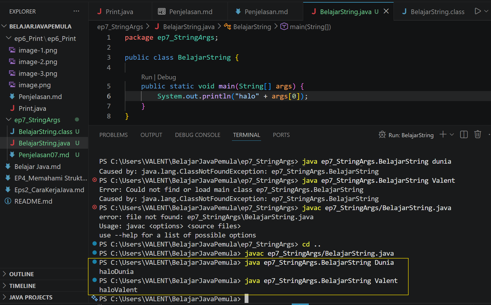

# 07 - Memahami String[] args

## Apa itu ``` String[] args ```?
* ``` String[] args ``` adalah sebuah arrray(kumpulan data) bertipe string yang dinamakan args(argument)
* parameter ini berguna untuk menerima input dari luar kode program (lewat terminal) pada saat program itu pertama kali dijalankan

## cara kerja ``` String[] args ````
* di sini kita akan buat file java dulu,lalu setelah jadi file java nya kita buat file class nya dengan cara:
``` javac namafile.java ```
* lalu buat komen println seperti biasa dan tambahin args di dalam nya,misal kayak gini:
``` System.out.println("Halo" + args[0]) ```

* lalu saya akan run dengan: ``` java NamaFile ``` lalu tambahin kata yang mau kita masukin args[0] nya lewat terminal,misal kata "dunia" jadi seperti ini:

disitu terlihat kalau saya juga menambahkan kata lain untuk uji coba memasukan kata tersebut ke dalam args[0] itu

## 📝 Kuis Java Dasar: Memahami String[] args dan Eksekusi CLI

Uji pemahamanmu mengenai bagaimana Java menerima argumen dari luar melalui terminal (`String[] args`), sistem indeks array, serta penanganan error terkait eksekusi program lewat CLI.

Pilih jawabanmu terlebih dahulu, lalu klik tombol **Lihat Kunci Jawaban & Pembahasan** untuk memeriksa hasil pilihanmu!

---

### 1. Apakah fungsi utama dari parameter `String[] args` yang terdapat di dalam main method pada program Java?
- [ ] A. Untuk menentukan jumlah baris kode yang boleh dieksekusi oleh JVM.
- [ ] B. Untuk menerima input atau argumen nilai dari luar program melalui terminal saat program pertama kali dijalankan.
- [ ] C. Untuk mengatur tipe data keluaran (output) dari seluruh fungsi di dalam kelas.
- [ ] D. Untuk menghubungkan program Java secara otomatis dengan database eksternal.

<details>
  <summary><b>👁️ Klik di sini untuk melihat Kunci Jawaban & Pembahasan</b></summary>

  **Jawaban yang Benar:** **B**
  
  *Pembahasan:* Parameter `String[] args` bertindak sebagai pintu masuk bagi data eksternal (argumen) yang diketikkan pengguna di terminal tepat pada saat mengeksekusi perintah `java`.
</details>

---

### 2. Jika kamu menjalankan program di terminal dengan perintah: `java BelajarString Valent Malang`, argumen `Malang` akan disimpan oleh Java di dalam variabel args pada indeks ke berapa?
- [ ] A. `args[0]`
- [ ] B. `args[1]`
- [ ] C. `args[2]`
- [ ] D. `args[-1]`

<details>
  <summary><b>👁️ Klik di sini untuk melihat Kunci Jawaban & Pembahasan</b></summary>

  **Jawaban yang Benar:** **B**
  
  *Pembahasan:* Array di dalam Java selalu menggunakan sistem penomoran berbasis nol (*zero-based indexing*). Kata pertama setelah nama program adalah `"Valent"` (`args[0]`), dan kata kedua adalah `"Malang"` (`args[1]`).
</details>

---

### 3. Apa jenis error atau exception yang akan muncul jika kodenya memanggil `args[0]` tetapi saat dijalankan di terminal kamu sama sekali tidak menuliskan argumen tambahan?
- [ ] A. `NullPointerException`
- [ ] B. `ClassNotFoundException`
- [ ] C. `ArrayIndexOutOfBoundsException`
- [ ] D. `ArithmeticException`

<details>
  <summary><b>👁️ Klik di sini untuk melihat Kunci Jawaban & Pembahasan</b></summary>

  **Jawaban yang Benar:** **C**
  
  *Pembahasan:* Saat kita tidak memasukkan argumen apa pun di terminal, array `args` memiliki panjang 0. Mengakses `args[0]` berarti kita meminta elemen yang berada di luar batas ukuran array tersebut, sehingga memicu `ArrayIndexOutOfBoundsException`.
</details>

---

### 4. Perhatikan potongan kode ini:
`System.out.println(args[0] + " " + args[1]);`

**Jika program dijalankan dengan perintah `java Main Halo Bandung`, apa outputnya?**
- [ ] A. Halo Bandung
- [ ] B. Main Halo
- [ ] C. Bandung Halo
- [ ] D. Error `ArrayIndexOutOfBoundsException`

<details>
  <summary><b>👁️ Klik di sini untuk melihat Kunci Jawaban & Pembahasan</b></summary>

  **Jawaban yang Benar:** **A**
  
  *Pembahasan:* Nama kelas/file (`Main`) tidak masuk hitungan array. Kata pertama setelahnya adalah `"Halo"` (`args[0]`) dan kata kedua adalah `"Bandung"` (`args[1]`). Keduanya digabungkan dengan spasi di tengahnya, menghasilkan output `"Halo Bandung"`.
</details>

---

### 5. Mengapa posisi folder (direktori) terminal sangat berpengaruh saat kita ingin mengompilasi atau menjalankan program Java secara manual menggunakan CLI?
- [ ] A. Karena Java hanya bisa berjalan jika terminal dibuka di folder `C:\Windows`.
- [ ] B. Agar perintah `javac` atau `java` dapat menemukan lokasi file fisik `.java` atau struktur package `.class` yang ingin dieksekusi.
- [ ] C. Karena folder yang berbeda memiliki kecepatan kompilasi kode yang berbeda pula.
- [ ] D. Posisi folder terminal sebenarnya tidak berpengaruh sama sekali.

<details>
  <summary><b>👁️ Klik di sini untuk melihat Kunci Jawaban & Pembahasan</b></summary>

  **Jawaban yang Benar:** **B**
  
  *Pembahasan:* Terminal bertindak sebagai penunjuk arah bagi sistem operasi. Jika terminal berada di folder yang salah, perintah `javac` akan mengeluarkan error `file not found` karena tidak bisa melihat file kodinganmu.
</details>

---

### 6. Jika sebuah file Java memiliki baris pertama `package ep7_StringArgs;` dan file tersebut berada di dalam folder dengan nama yang sama, di manakah posisi terminal yang ideal saat kita ingin menjalankan perintah `java ep7_StringArgs.BelajarString`?
- [ ] A. Tepat di dalam folder `ep7_StringArgs`.
- [ ] B. Di folder akar (root/parent) sebelum folder `ep7_StringArgs`.
- [ ] C. Di folder mana saja bebas, asalkan di Local Disk C.
- [ ] D. Di dalam folder `bin` milik instalasi JDK.

<details>
  <summary><b>👁️ Klik di sini untuk melihat Kunci Jawaban & Pembahasan</b></summary>

  **Jawaban yang Benar:** **B**
  
  *Pembahasan:* Aturan *classpath* Java mengharuskan kita menjalankan program yang memiliki struktur package dari luar folder package tersebut (folder parent-nya), agar Java bisa melacak folder package sebagai bagian dari nama kelas (`ep7_StringArgs.BelajarString`).
</details>

---

### 7. Apa arti dari pesan error `Caused by: java.lang.ClassNotFoundException` saat kita menjalankan perintah `java` di terminal?
- [ ] A. Struktur kode pemrograman kita memiliki kesalahan pengetikan sintaksis (*typo*).
- [ ] B. Komputer kehabisan memori RAM saat menjalankan program.
- [ ] C. Java tidak dapat menemukan file `.class` (hasil kompilasi) dari nama kelas yang kita panggil di direktori tersebut.
- [ ] D. Versi Java yang kita gunakan terlalu lama (*outdated*).

<details>
  <summary><b>👁️ Klik di sini untuk melihat Kunci Jawaban & Pembahasan</b></summary>

  **Jawaban yang Benar:** **C**
  
  *Pembahasan:* Error ini muncul karena Java Virtual Machine (JVM) tidak berhasil menemukan cetakan bytecode (`.class`) dari nama kelas yang diminta, biasanya terjadi karena salah posisi folder terminal atau salah menuliskan nama kelas.
</details>

---

### 8. Perhatikan potongan kode ini:
`public static void main(String[] args) { System.out.println(args.length); }`

**Jika dijalankan dengan perintah `java Main kopi susu coklat`, apa output angka yang muncul di layar?**
- [ ] A. 0
- [ ] B. 1
- [ ] C. 2
- [ ] D. 3

<details>
  <summary><b>👁️ Klik di sini untuk melihat Kunci Jawaban & Pembahasan</b></summary>

  **Jawaban yang Benar:** **D**
  
  *Pembahasan:* Properti `.length` pada array digunakan untuk mengetahui jumlah total elemen di dalam array tersebut. Karena kita memasukkan 3 kata argumen (`kopi`, `susu`, `coklat`), maka ukuran array `args` adalah 3.
</details>

---

### 9. Bagaimana cara memasukkan satu kalimat utuh yang mengandung spasi (misalnya: `Polinema Malang`) agar dianggap sebagai SATU argumen saja di `args[0]`?
- [ ] A. Menghubungkannya dengan tanda tambah, contoh: `Polinema+Malang`
- [ ] B. Mengapit kalimat tersebut dengan tanda petik dua, contoh: `"Polinema Malang"`
- [ ] C. Memberikan tanda garis miring, contoh: `Polinema/Malang`
- [ ] D. Tidak bisa, Java akan selalu memisahkan argumen berdasarkan spasi secara mutlak.

<details>
  <summary><b>👁️ Klik di sini untuk melihat Kunci Jawaban & Pembahasan</b></summary>

  **Jawaban yang Benar:** **B**
  
  *Pembahasan:* Secara bawaan terminal memisahkan argumen menggunakan spasi. Namun, jika kita membungkus teks menggunakan tanda petik dua (`"kalimat spasi"`), terminal akan menganggap seluruh teks di dalam petik tersebut sebagai satu kesatuan argumen tunggal.
</details>

---

### 10. Jika kita tidak ingin direpotkan dengan aturan folder package saat menjalankan uji coba kode lewat CLI terminal, apa langkah modifikasi kode yang paling instan?
- [ ] A. Menghapus baris kode `package ...` yang ada di baris paling atas file `.java`.
- [ ] B. Mengubah nama `main` menjadi nama lain yang bebas.
- [ ] C. Menghapus parameter `String[] args` dari dalam tanda kurung method main.
- [ ] D. Memindahkan semua kode ke dalam satu baris yang sama.

<details>
  <summary><b>👁️ Klik di sini untuk melihat Kunci Jawaban & Pembahasan</b></summary>

  **Jawaban yang Benar:** **A**
  
  *Pembahasan:* Dengan menghapus deklarasi `package` di baris paling atas, file Java tersebut akan berada di *default package*. Efeknya, kamu bisa bebas melakukan kompilasi dan menjalankan file tersebut langsung dari dalam folder tempat file itu berada tanpa aturan classpath yang rumit.
</details>