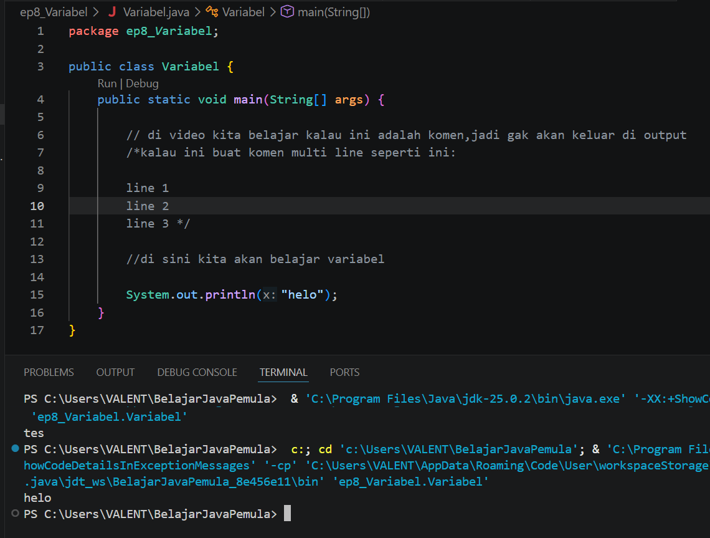
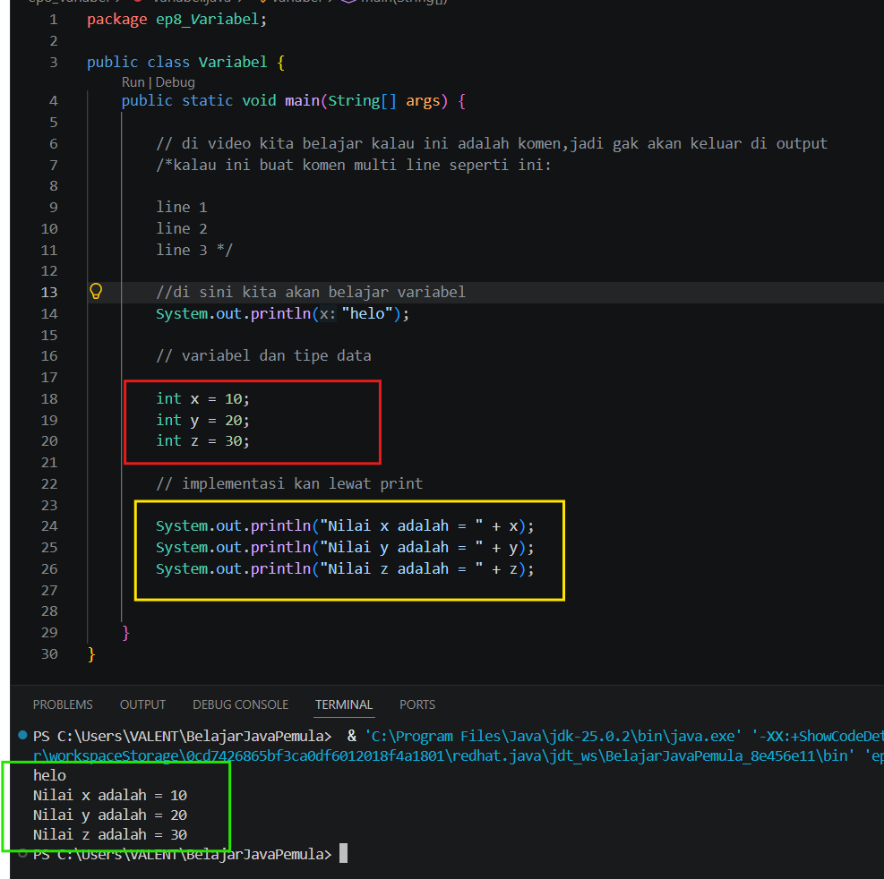
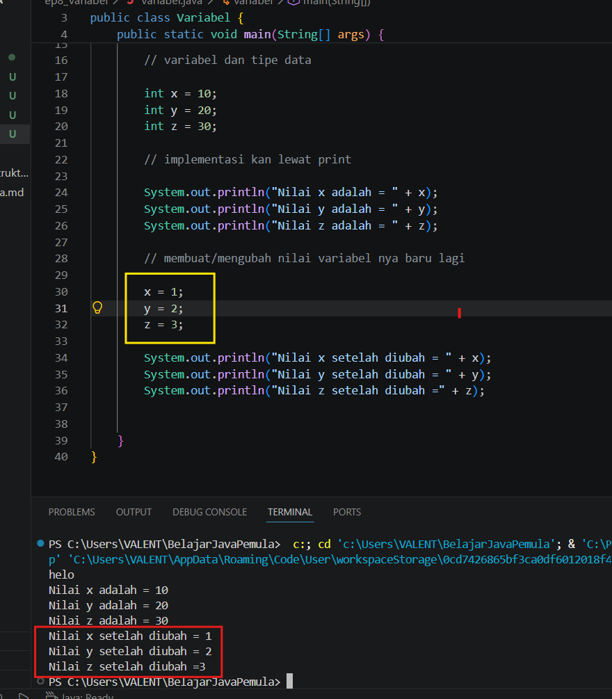

#  08 - Variabel, Assignment dan Deklarasi

## 1. Komen ``` // ```
di video kita belajar kalau kita memakai kode ```//``` itu hanyalah komen yang biasanya dipakai untuk penjelasan/bantuan terhadap kode itu,bisa juga pakai ``` /*  */ ``` untuk komen multi line,dan komen ini tidak akan mempengaruhi kode program yang asli dan tidak akan keluar juga di output nya,seperti ini:


## 2. Variabel dan tipe data
di matematika pasti sudah belajar yang namanya variabel,yaitu simbol/lambang yang digunakan untuk mewakaili suatu nilai yang pasti atau tidak pasti (kalau di matematika biasanya nilai nya belum dipastikan),misal kita punya variabel seperti berikut:
```
x = 10;
y = 20;
z = 30;
```
nah gimana caranya kita mengimplementasikan variabel ini ke dalam bahasa java?,nah kita akan memakai yang namanya tipe data.

nah disini kita belum belajar yang namanya tipe data,itu akan kita bahas di ep berikutnya,tapi disini saya akan beri contoh tipe data yang paling umum digunakan untuk bisa mengimplementasikan variabel yang di atas ke dalam program java,yaitu ``` int ``` :

```
int x = 10;
int y = 20;
int z = 30;
```
dan kita akan mengimplementasikan variabel nya dengan print seperti ini:

Seperti yang terlihat disitu,yang kotak merah adalah implementasi dari variabel agar java bisa membaca lewat tipe data int (integer) kotak kuning adalah cara agar hasil implementasi variabel tersebut agar bisa ditampilkan di terminal output dan kotak hijau adalah hasilnya

### cara membuat variabel baru lagi
kita gak perlu pake tipe data lagi,karena kan sudah ditentukan dari awal tipe data nya apa dari awal yaitu ``` int ``` seperti ini:

jadi seperti yang terlihat di kotak kuning kita tidak perlu pakai tipe data lagi untuk mengimplementasikan variabel itu,dan kita bisa memunculkan output nya lagi lewat print dan hasilnya setelah diubah bisa dilihat di kotak merah

jadi ini tuh sama seperti pelajaran kita sebelumnya di ep 6 yaitu proses alur eksekusi java dari atas hingga bawah,jadinya hasil variabel di atas ditampilkan dulu lalu yang bawah (yang diubah) akan ditampilkan

## 📝 Kuis Java Dasar: Variabel, Deklarasi, dan Assignment

Uji pemahamanmu mengenai konsep dasar memori di Java, cara membuat variabel (Deklarasi), mengisi nilai (Assignment), serta aturan penamaan variabel.

Pilih jawabanmu terlebih dahulu, lalu klik tombol **Lihat Kunci Jawaban & Pembahasan** untuk memeriksa hasil pilihanmu!

---

### 1. Di dalam pemrograman Java, apakah yang dimaksud dengan "Variabel"?
- [ ] A. Sebuah fungsi khusus untuk mencetak teks ke layar terminal.
- [ ] B. Nama file atau folder tempat menyimpan program Java.
- [ ] C. Kontainer atau tempat di dalam memori komputer (RAM) yang digunakan untuk menyimpan data.
- [ ] D. Komponen perangkat keras yang mempercepat kompilasi kode.

<details>
  <summary><b>👁️ Klik di sini untuk melihat Kunci Jawaban & Pembahasan</b></summary>

  **Jawaban yang Benar:** **C**
  
  *Pembahasan:* Variabel adalah sebuah nama atau pengenal (*identifier*) yang mewakili suatu lokasi di memori komputer (RAM) untuk menyimpan nilai tertentu yang datanya bisa berubah-ubah selama program berjalan.
</details>

---

### 2. Apakah istilah yang digunakan untuk proses "membuat atau memesan tempat" di memori dengan menentukan tipe data dan nama variabelnya?
- [ ] A. Assignment
- [ ] B. Deklarasi (Declaration)
- [ ] C. Kompilasi
- [ ] D. Inisialisasi

<details>
  <summary><b>👁️ Klik di sini untuk melihat Kunci Jawaban & Pembahasan</b></summary>

  **Jawaban yang Benar:** **B**
  
  *Pembahasan:* Deklarasi (*Declaration*) adalah proses mendaftarkan variabel baru ke Java. Saat melakukan deklarasi, kita wajib menentukan tipe datanya terlebih dahulu lalu diikuti dengan nama variabelnya, contoh: `int angka;`.
</details>

---

### 3. Apakah istilah yang digunakan untuk proses "mengisi atau memasukkan nilai" ke dalam suatu variabel yang sudah dibuat?
- [ ] A. Assignment
- [ ] B. Deklarasi
- [ ] C. Kompilasi
- [ ] D. Eksekusi

<details>
  <summary><b>👁️ Klik di sini untuk melihat Kunci Jawaban & Pembahasan</b></summary>

  **Jawaban yang Benar:** **A**
  
  *Pembahasan:* *Assignment* adalah proses memberikan nilai ke dalam variabel menggunakan operator sama dengan (`=`), contoh: `angka = 10;`. Nilai di sebelah kanan tanda `=` akan dimasukkan ke dalam variabel di sebelah kiri.
</details>

---

### 4. Manakah sintaks di Java yang melakukan proses "Deklarasi sekaligus Inisialisasi (Assignment pertama kali)" dalam satu baris?
- [ ] A. `x = 5;`
- [ ] B. `int x; x = 5;`
- [ ] C. `int x = 5;`
- [ ] D. `int x == 5;`

<details>
  <summary><b>👁️ Klik di sini untuk melihat Kunci Jawaban & Pembahasan</b></summary>

  **Jawaban yang Benar:** **C**
  
  *Pembahasan:* Menuliskan `int x = 5;` berarti kita memesan memori bertipe data integer bernama `x` sekaligus langsung mengisinya dengan nilai `5` di saat yang bersamaan.
</details>

---

### 5. Perhatikan potongan kode berikut:
`int nilai;`
`nilai = 50;`
`nilai = 80;`

**Jika kita memanggil `System.out.println(nilai);`, berapakah nilai yang akan muncul di console?**
- [ ] A. 50
- [ ] B. 80
- [ ] C. 130
- [ ] D. Error karena variabel diisi dua kali.

<details>
  <summary><b>👁️ Klik di sini untuk melihat Kunci Jawaban & Pembahasan</b></summary>

  **Jawaban yang Benar:** **B**
  
  *Pembahasan:* Karena alur eksekusi program Java berjalan dari atas ke bawah, nilai variabel dapat ditimpa (*overwrite*). Nilai `50` pada baris kedua akan digantikan oleh nilai `80` pada baris ketiga, sehingga nilai terakhirnya adalah `80`.
</details>

---

### 6. Java merupakan bahasa pemrograman yang bersifat "Strongly Typed". Apa arti dari istilah tersebut terkait variabel?
- [ ] A. Kita bebas mengubah tipe data suatu variabel kapan saja di tengah program.
- [ ] B. Setiap variabel wajib ditentukan tipe datanya sejak awal dan tidak bisa diisi oleh tipe data yang berbeda di kemudian hari.
- [ ] C. Nama variabel harus ditulis menggunakan huruf kapital semua.
- [ ] D. Variabel di Java hanya bisa menyimpan angka, tidak bisa menyimpan teks.

<details>
  <summary><b>👁️ Klik di sini untuk melihat Kunci Jawaban & Pembahasan</b></summary>

  **Jawaban yang Benar:** **B**
  
  *Pembahasan:* *Strongly Typed* berarti Java sangat ketat terhadap aturan tipe data. Jika sebuah variabel dideklarasikan sebagai `int` (integer/angka bulat), maka sampai program selesai variabel tersebut tidak akan pernah bisa diisi dengan teks (*String*) atau tipe data lain yang tidak kompatibel.
</details>

---

### 7. Manakah di antara nama variabel berikut yang VALID dan diperbolehkan dalam aturan penamaan variabel di Java?
- [ ] A. `int 10Nilai;`
- [ ] B. `int nilai utama;`
- [ ] C. `int nilai_utama;`
- [ ] D. `int nilai-utama;`

<details>
  <summary><b>👁️ Klik di sini untuk melihat Kunci Jawaban & Pembahasan</b></summary>

  **Jawaban yang Benar:** **C**
  
  *Pembahasan:* Nama variabel di Java tidak boleh diawali dengan angka (A salah), tidak boleh mengandung spasi (B salah), dan tidak boleh menggunakan karakter tanda hubung/minus (D salah). Karakter simbol yang diperbolehkan hanyalah *underscore* (`_`) dan tanda dolar (`$`).
</details>

---

### 8. Di dalam pemrograman Java, gaya penulisan nama variabel yang direkomendasikan jika terdiri dari dua kata atau lebih adalah "camelCase". Manakah contoh penulisan camelCase yang benar?
- [ ] A. `int NilaiUjianAkhir;`
- [ ] B. `int nilaiujianakhir;`
- [ ] C. `int nilai_ujian_akhir;`
- [ ] D. `int nilaiUjianAkhir;`

<details>
  <summary><b>👁️ Klik di sini untuk melihat Kunci Jawaban & Pembahasan</b></summary>

  **Jawaban yang Benar:** **D**
  
  *Pembahasan:* Gaya *camelCase* menyarankan agar kata pertama diawali dengan huruf kecil, kemudian kata kedua dan kata-kata selanjutnya diawali dengan huruf kapital tanpa menggunakan spasi atau penghubung, menyerupai punuk unta.
</details>

---

### 9. Perhatikan potongan kode berikut:
`int a = 10;`
`int b = a;`

**Apakah arti dari baris kedua (`int b = a;`) pada kode di atas?**
- [ ] A. Membuat variabel baru bernama `b` dan menyalin nilai yang ada di dalam variabel `a` ke dalamnya.
- [ ] B. Mengubah nama variabel `a` menjadi `b`.
- [ ] C. Menghapus nilai yang ada di dalam variabel `a`.
- [ ] D. Menjumlahkan variabel `a` dan `b`.

<details>
  <summary><b>👁️ Klik di sini untuk melihat Kunci Jawaban & Pembahasan</b></summary>

  **Jawaban yang Benar:** **A**
  
  *Pembahasan:* Proses *assignment* `b = a` berarti kita mengambil nilai yang saat ini tersimpan di memori variabel `a` (yaitu `10`), lalu menduplikat atau menyalin nilai tersebut ke dalam tempat memori variabel `b`.
</details>

---

### 10. Mengapa kita tidak boleh mendeklarasikan dua variabel dengan nama yang sama persis di dalam satu lingkup (scope) yang sama?
- [ ] A. Karena komputer akan kehabisan kapasitas memori RAM.
- [ ] B. Karena Java akan bingung variabel mana yang dimaksud saat nama tersebut dipanggil di baris kode selanjutnya (Identifier Conflict).
- [ ] C. Karena nama variabel di Java sudah otomatis diatur oleh sistem operasi.
- [ ] D. Hal itu sebenarnya diperbolehkan dan tidak akan memicu error apa pun.

<details>
  <summary><b>👁️ Klik di sini untuk melihat Kunci Jawaban & Pembahasan</b></summary>

  **Jawaban yang Benar:** **B**
  
  *Pembahasan:* Nama variabel bertindak sebagai alamat penunjuk yang unik di memori. Jika ada dua variabel dengan nama yang sama persis dalam satu cakupan, compiler Java akan mendeteksi error *duplicate local variable* karena terjadinya konflik identitas.
</details>
